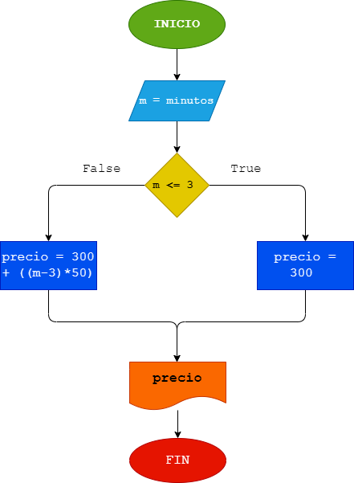

# Llamada telefónica
# Análisis 
Ingresar el tiempo de duración de una llamada telefónica y determinar la cantidad a pagar, de acuerdo con lo siguiente: 
a. Toda llamada que dure 3 minutos o menos tiene un costo de 300 pesos. 
b. Cada minuto adicional cuesta 50 pesos.
# Diseño 
## Diagrama de flujo

